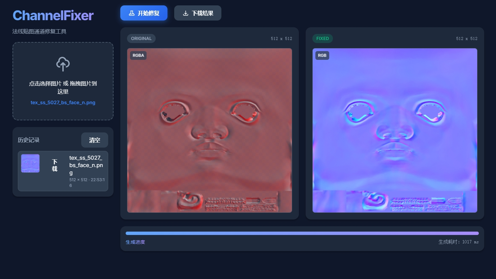

# ChannelFixer · 法线贴图通道修复工具

一个轻量、纯前端的图片通道编辑器，专为法线贴图等通道重排场景设计。支持本地图片拖拽预览与一键修复，无需安装后端服务或依赖。


## 功能特性
- 支持本地图片选择与拖拽导入
- 预览区横向并排展示“原图”和“修复后”两张卡片
- 预览框为正方形缩略图，保持比例、居中显示，点击可查看原尺寸
- 通道修复逻辑：
  - 绿色通道黑白翻转（`G = 255 - G`）
  - 透明通道拷贝到红通道（`R = A`）
  - 红通道拷贝到蓝通道（`B = R`）
  - 丢弃原图蓝通道，并将透明通道设为不透明（`A = 255`）
- 左侧历史记录带缩略图、名称、分辨率时间戳，支持一键下载与“清空”按钮
- 每个预览框左上角显示通道信息徽标：原图自动识别 `RGB/RGBA`，修复结果为 `RGB`
- 纯前端实现，无后端依赖

## 在线预览
本项目为纯静态网页，可直接通过任意静态服务器打开。例如：
```
python -m http.server 8000
```
启动后访问：
```
http://localhost:8000/
```
如果 IPv6 地址不可用，请使用上述 IPv4 地址而非 `http://[::]:8000/`。


## 使用指南
1. 打开页面后，点击“选择图片”或将图片拖入左侧上传区域
2. 中央预览区并排显示原图与修复后卡片，左上角显示通道信息
3. 点击“开始修复”，自动进行通道处理；点击任一预览可在新窗口查看原尺寸
4. 左侧历史记录添加当前修复缩略图，点击“下载”保存为 PNG；需要清理时点击“清空”

## 支持格式
- 浏览器原生可解码的图片格式：`PNG`, `JPEG`（`TGA`在多数浏览器不直接支持）
- 如果需要 `TGA` 支持，可在后续版本引入前端解码库（如 `tga.js`）

## 技术栈
- 原生 `HTML/CSS/JavaScript`
- 使用 `Canvas` 进行逐像素处理与预览
- 无外部依赖，兼容现代浏览器

## 项目结构
```
FixNormalMapChannel/
├── index.html    # 页面结构与UI
├── style.css     # 新潮深色系主题与布局
├── script.js     # 文件加载、通道处理、下载逻辑
└── README.md     # 项目说明
```

## 开发与部署
- 静态部署到任意静态托管平台（GitHub Pages、Netlify、Vercel 等）
- 或本地运行任意静态服务器（如 `http-server`, `python -m http.server`）

## 后续规划
- `TGA`/`EXR` 等更多格式支持
- 批量处理与快捷键

## 许可
MIT License
